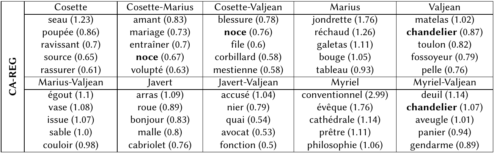
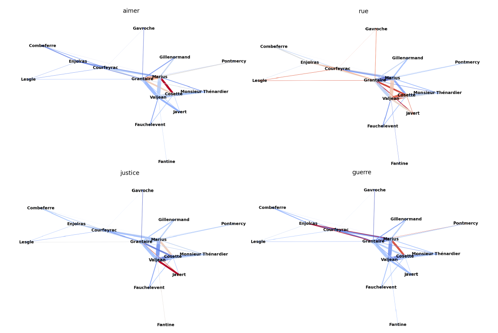
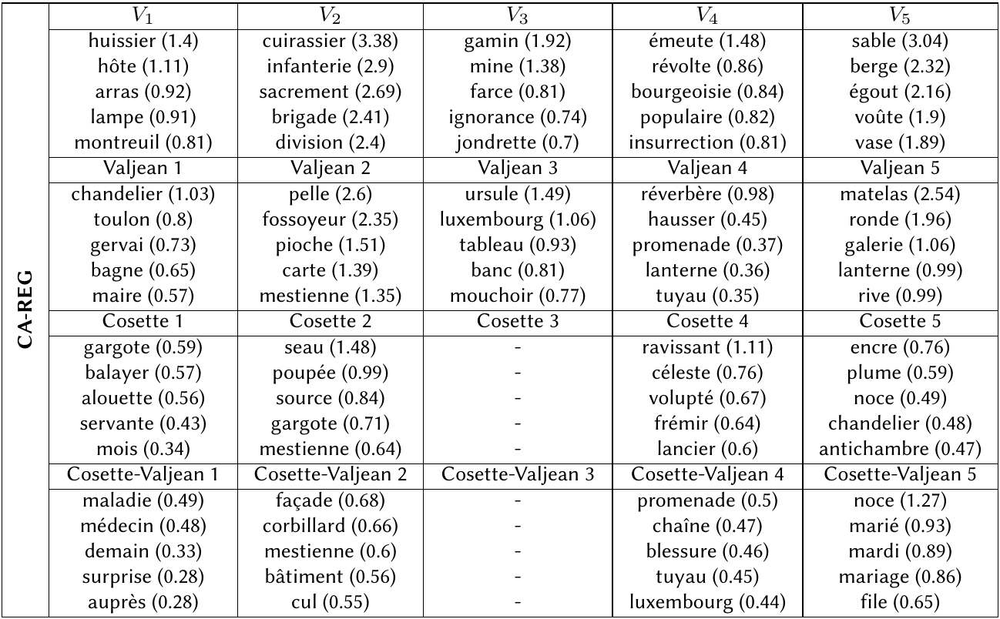

# A Framework for Embedding Entities in a Textual Narrative: a Case Study on *Les Misérables*

Welcome to the GitHub repository for the (upcoming) article *A Framework for Embedding Entities in a Textual Narrative: a Case Study on Les Misérables*.

## Abstract 

In this article, we propose a general and flexible framework in order to study *narrative entities* found in a literary work. This framework is exposed starting from a broad perspective, consisting in how to segment the work into *textual unit* and organize the resulting data, and is narrowed down to a particular case: the study of characters and relationships found in *Les Misérables*. A notable choice was made in the current instance of the framework: the construction of *embeddings* containing both textual units and narrative entities alongside words. These embeddings, where different spatial regions can be interpreted with word vectors, are the keys helping us to characterize studied entities. Four types of embedding methods are constructed, and their results on *Les Misérables* permit to show the potential of this framework in order to analyses characters and relationships in a narrative

## Results examples

#### Most associated words with some characters and relationships in *Les Misérables*

#### Most associated relationships with some words (red = high, blue = low)

#### Evolution of word associations regarding depending on the volumes

## Organisation of this page

- All classes and functions needed to run algorithms, compute statistics, and more, are found in the `local_functions.py` 
script. These functions are documented by docstrings.
- The "CA_*" and the "WV_*" scripts are the one who produced results in the articles.
- The folder **results** contains extensive results on *Les Misérables*
- The folder **corpora** contains corpora.
- The folder **other_scripts** contains scripts which help to produced other results.
- The folder **old_scripts** contains outdated scripts.
- The folder **aux_files** contains helper files, like stopwords.

